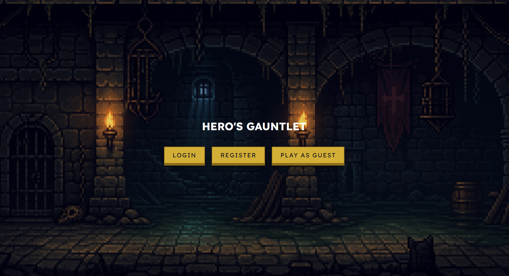
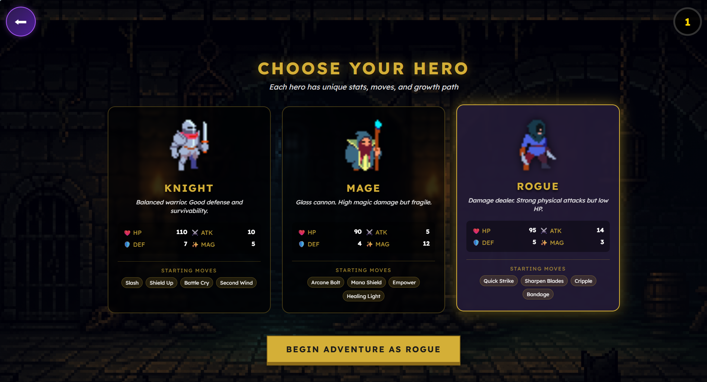
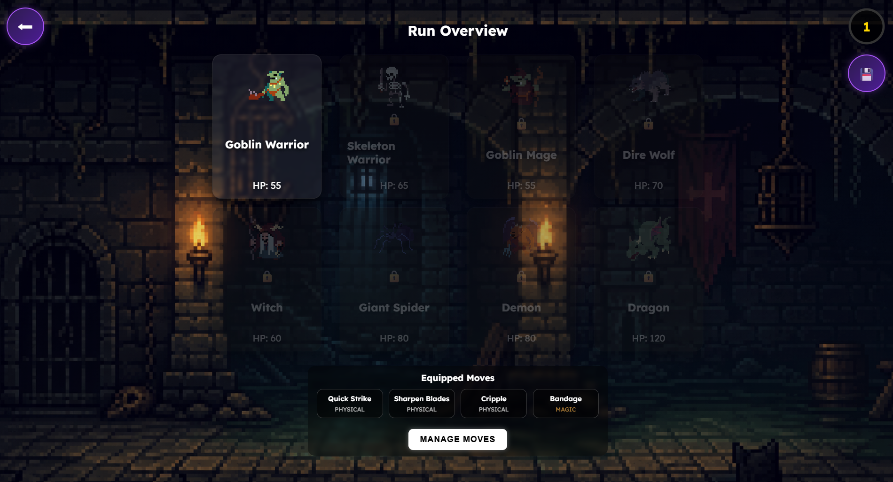
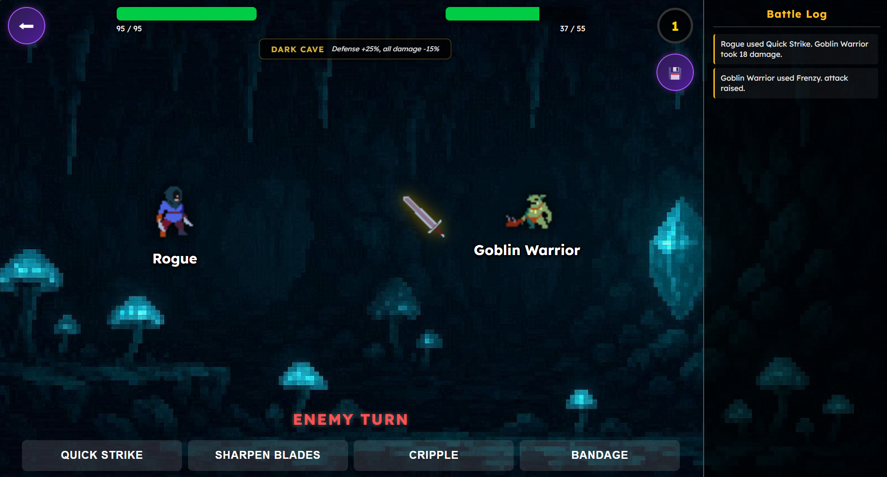
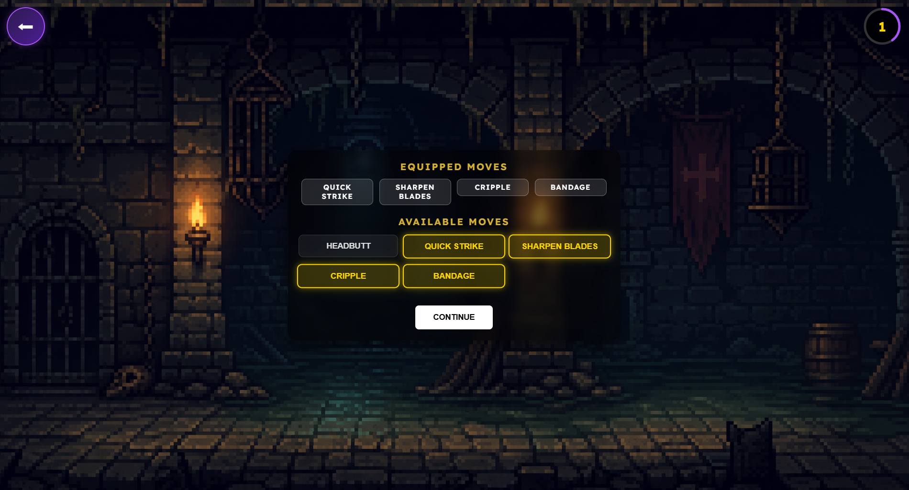
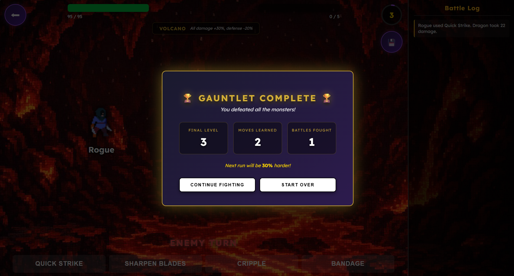

# Hero's Gauntlet

A turn-based RPG built for the Nordeus Job Fair 2026 Full Stack Challenge. Pick a hero class, fight your way through eight monsters, learn their moves after each victory, and beat the entire gauntlet to unlock New Game+.

Built with **Angular 20** on the frontend and **Node.js + Express + TypeScript** on the backend, with **MySQL** for persistence.

---

## 📸 Screenshots

| Main Menu | Hero Selection | Run Overview |
|-----------|----------------|--------------|
|  |  |  |

| Battle | Move Manager | Gauntlet Complete |
|--------|--------------|-------------------|
|  |  |  |
---

## 🎮 Features

### Core Gameplay
- **Turn-based combat** with physical and magic attacks
- **Eight unique monsters** that get progressively harder, each with their own moveset
- **Move learning system** — defeat a monster and randomly learn one of its moves
- **Stat progression** — choose between attack, defense, magic, or HP boost on level up
- **Server-authoritative damage calculation** to prevent client-side cheating

### Bonus Features
- **Three hero classes** — Knight, Mage, and Rogue, each with unique base stats, stat gains per level, and starting movesets
- **Six battle environments** — Open Field, Forest, Mountain Peak, Dark Cave, Volcano, and Ancient Temple, each with their own damage and defense modifiers
- **Smart enemy AI** — monsters with healing moves will use them when low on HP
- **Battle log sidebar** showing every action in the current fight
- **Battle animations** — projectiles fly between hero and monster based on move type, damage numbers float on hit, sprites shake when struck
- **Move tooltips** showing description and effect type
- **Save & Exit** mid-battle — pick up exactly where you left off, including HP, monster state, environment, and battle log
- **New Game+** — finish the gauntlet, then continue fighting with a 30% stat boost per completed run; stack as many times as you want
- **Animated XP ring** in the top-right corner that fills as you gain experience
- **Move manager** for swapping equipped moves between battles
- **Account system** with optional registration — play as guest or create an account to save progress between sessions

---

## 🛠️ Tech Stack

| Layer | Technology |
|-------|-----------|
| Frontend | Angular 20, TypeScript, RxJS |
| Backend | Node.js, Express 4, TypeScript |
| Database | MySQL 8 |
| Authentication | JWT, bcrypt |

---

## 🚀 Setup & Installation

### Prerequisites

- **Node.js** v18+ (LTS recommended)
- **MySQL** v8+ (any working MySQL Server installation)
- **Angular CLI** v20+ (install with `npm install -g @angular/cli` if not already installed)

### 1. Clone the repository

```bash
git clone https://github.com/mijcic/Heros-Gauntlet.git
cd Heros-Gauntlet
```

### 2. Set up the database

Open MySQL Workbench (or any MySQL client) and run the SQL script provided:

```bash
database/database.sql
```

This creates the `rpg-game` database and four tables: `users`, `heroes`, `learned_moves`, and `saved_runs`.

You can also run it from the command line:

```bash
mysql -u root -p < database/database.sql
```

### 3. Configure environment variables

Inside the `backend/` folder, copy the example env file:

```bash
cd backend
cp .env.example .env
```

Then edit `.env` and set your MySQL password:

```env
PORT=4000
JWT_SECRET=your-secret-key

DB_HOST=localhost
DB_USER=root
DB_PASSWORD=your-mysql-password
DB_NAME=rpg-game
```

### 4. Install backend dependencies and start the server

Still in the `backend/` folder:

```bash
npm install
npm run build
npm start
```

You should see `Express running on port 4000!` in the terminal.

### 5. Install frontend dependencies and start the app

In a **new terminal**, go to the frontend folder:

```bash
cd frontend
npm install
ng serve
```

Once the build completes, open your browser at:

```
http://localhost:4200
```

That's it — you're ready to play.

---

## 🎯 How to Play

1. **Register or play as guest** from the main menu
2. **Choose your class** — Knight, Mage, or Rogue
3. From the **Run Overview**, click on any unlocked monster
4. **Pick a battle environment** — each one tweaks damage, defense, or healing
5. **Fight!** Pick your move each turn, the monster responds. Reduce monster HP to 0 to win.
6. After each victory, you **learn a random move** from the defeated monster — manage your equipped moves between battles
7. **Beat all 8 monsters** to complete the gauntlet, then choose to **continue fighting** for New Game+ or **start over** with a fresh hero

### Hero Classes

| Class | HP | Attack | Defense | Magic | Style |
|-------|-----|--------|---------|-------|-------|
| **Knight** | 110 | 10 | 7 | 5 | Balanced tank with sturdy defense |
| **Mage** | 90 | 5 | 4 | 12 | Glass cannon with high magic damage |
| **Rogue** | 95 | 14 | 5 | 3 | Aggressive damage dealer with low HP |

Each class also has different stat growth per level — Mage gains the most magic, Rogue the most attack, Knight gains balanced stats and the most HP.

### Damage Formula

- **Physical damage** = `move value + attacker attack − target defense`
- **Magic damage** = `move value + attacker magic` (ignores defense)
- **Healing** = `move value + caster magic`

All values are then multiplied by the active environment's modifiers.

### Environments

| Environment | Effect |
|-------------|--------|
| **Open Field** | Physical damage +25%, magic damage −15% |
| **Misty Forest** | Magic damage +30%, physical damage −10% |
| **Mountain Peak** | All damage +30%, healing −40% |
| **Dark Cave** | Defense +25%, all damage −15% |
| **Volcano** | All damage +30%, defense −20% |
| **Ancient Temple** | Healing +50%, damage −10% |

---

## 📁 Project Structure

```
Heros-Gauntlet/
├── backend/
│   ├── src/
│   │   ├── controllers/      # auth.controller, game.controller, save.controller
│   │   ├── data/             # moves, monsters, environments, hero classes
│   │   ├── database/         # MySQL connection pool
│   │   ├── middleware/       # JWT auth middleware
│   │   ├── models/           # TypeScript interfaces
│   │   ├── routers/          # Express route mappings
│   │   ├── state/            # In-memory game state
│   │   └── server.ts         # Express server entry point
│   ├── .env.example
│   ├── package.json
│   └── tsconfig.json
│
├── frontend/
│   ├── src/
│   │   ├── app/
│   │   │   ├── components/   # back-button, level-ring (reusable)
│   │   │   ├── interceptors/ # auth interceptor (JWT injection)
│   │   │   ├── models/       # TypeScript interfaces
│   │   │   ├── pages/        # main-menu, hero-selection, run-overview, battle, move-manager
│   │   │   ├── services/     # game service (HTTP + reactive state)
│   │   │   ├── app.config.ts
│   │   │   └── app.routes.ts
│   │   └── assets/pictures/  # sprites for heroes, monsters, moves, environments
│   ├── angular.json
│   └── package.json
│
├── database/
│   └── database.sql          # MySQL schema setup
│
└── README.md
```

---

## 🌐 API Overview

The backend exposes a REST-style API on `http://localhost:4000`. Routes are grouped logically:

| Method | Endpoint | Description |
|--------|----------|-------------|
| POST | `/auth/register` | Create a new account |
| POST | `/auth/login` | Login, returns JWT |
| GET | `/run/config` | Get monster list (with optional `multiplier` for New Game+) |
| GET | `/environments` | Get list of available environments |
| GET | `/hero-classes` | Get list of hero classes |
| GET | `/hero` | Get current hero data |
| POST | `/hero/select-class` | Select hero class (resets stats) |
| POST | `/hero/choose-stat` | Apply level-up stat boost |
| POST | `/hero/learned-move` | Save learned move to database |
| POST | `/hero/reset` | Reset hero to defaults |
| POST | `/hero/continue-fighting` | Start New Game+ |
| POST | `/battle/set-monster` | Set the active monster for the upcoming fight |
| POST | `/battle/set-environment` | Set the active environment |
| POST | `/battle/attack` | Player plays a move, returns updated state |
| POST | `/battle/next-move` | Monster takes its turn |
| POST | `/run/save` | Save current run state |
| GET | `/run/load` | Load saved run state |
| DELETE | `/run/save` | Delete saved run |

Routes that require authentication use a JWT middleware that gracefully falls back to guest mode if no token is provided — most endpoints work for both logged-in users and guests.

---

## 🧠 Architectural Decisions

### Server-authoritative game logic
All damage calculation, leveling, and environment effects are computed on the backend. The frontend only displays state — it never decides outcomes. This makes the game cheat-resistant; modifying values in browser DevTools has no effect on actual battle results.

### Reactive hero state with BehaviorSubject
The frontend uses RxJS `BehaviorSubject` in the game service to broadcast hero changes. The Level Ring component subscribes once and automatically updates whenever the hero levels up, takes damage, or gains stats — no manual refresh needed.

### Dual storage system (guest vs logged-in)
Guests have everything stored in `localStorage` — no backend writes. Logged-in users have their data persisted to MySQL through dedicated endpoints. The same routes serve both: middleware extracts `userId` if a JWT is present, and controllers branch on its existence. This means there's no code duplication for two user types.

### In-memory game state on the backend
The current battle (active monster, environment, buff/debuff durations) lives in a single in-memory `gameState` object. This avoids hammering the database with a SQL update on every turn for transient values like buff timers. Persistent data (hero stats, learned moves) still goes to MySQL after each battle resolves.

### JSON column for save state
The `saved_runs` table uses MySQL's native `JSON` type for the run state. This lets the schema stay flexible — adding new fields to the save state (like the battle log or environment) doesn't require a migration. The `ON DUPLICATE KEY UPDATE` clause makes saving a single atomic upsert.

### Type safety with TypeScript on both sides
Both frontend and backend use TypeScript with shared interface concepts (Hero, Monster, Move). The HTTP service in Angular declares response types so components get autocomplete on response objects, and the backend uses interfaces to ensure controllers handle the right shape of data.

---

## 🔐 Notes on Security

- Passwords are hashed with **bcrypt** (10 salt rounds) — plaintext passwords are never stored
- JWTs are signed with a server-side secret read from the `.env` file
- The same generic message (`Invalid credentials`) is returned for both wrong-username and wrong-password to prevent username enumeration
- All MySQL queries use **prepared statements** (`?` placeholders) to prevent SQL injection
- The `.env` file is gitignored so secrets never reach version control — `.env.example` shows the expected variables instead

For a production deployment, the JWT secret would come from a secrets manager rather than a file, and tokens would have shorter expiry plus refresh-token logic. For a demo, this setup is intentionally kept simple.

---

## 🐛 Known Limitations

- **Single shared `gameState` on the backend** — works for single-player demo, but would need per-user state (or Redis) for multiple concurrent players
- **No move expiry on JWT** — token is valid until manually cleared from `localStorage`
- **One save slot per user** — no support for multiple parallel runs

These were conscious trade-offs for delivery scope. None affect the core gameplay experience.
